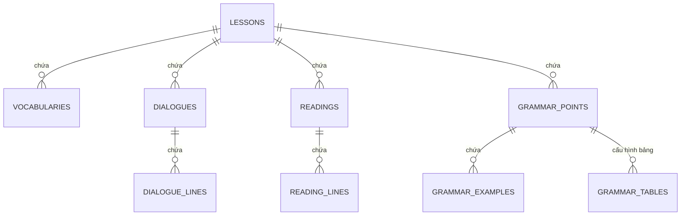

# Kịch bản thiết kế Cơ sở Dữ liệu Quan hệ (SQL Schema Plan)

Nếu bạn muốn nâng cấp ứng dụng để lưu trữ dữ liệu trong cơ sở dữ liệu quan hệ (ví dụ: PostgreSQL, MySQL, SQLite), cấu trúc dữ liệu sẽ được chuẩn hóa thành các bảng quan hệ liên kết với nhau qua các khóa ngoại (Foreign Keys).

Dưới đây là sơ đồ thiết kế chi tiết cho các bảng SQL.

---

## Sơ đồ Thực thể Mối quan hệ (Entity-Relationship Diagram)



---

## Chi tiết các bảng SQL

### 1. Bảng `lessons` (Quản lý Bài học)
Bảng trung tâm để liên kết tất cả từ vựng, hội thoại, ngữ pháp và bài đọc của từng bài.

```sql
CREATE TABLE lessons (
    id VARCHAR(50) PRIMARY KEY,       -- Ví dụ: 'lesson-0', 'lesson-1'
    lesson_title VARCHAR(100) NOT NULL, -- Ví dụ: 'Bài 0: Chào hỏi'
    order_num INT NOT NULL UNIQUE       -- Thứ tự sắp xếp các bài
);
```

### 2. Bảng `vocabularies` (Quản lý Từ vựng)
```sql
CREATE TABLE vocabularies (
    id VARCHAR(50) PRIMARY KEY,       -- Ví dụ: '0_1'
    lesson_id VARCHAR(50) REFERENCES lessons(id) ON DELETE CASCADE,
    character VARCHAR(100) NOT NULL,    -- Chữ Hán (我, 你)
    pinyin VARCHAR(100) NOT NULL,       -- Phiên âm (wǒ, nǐ)
    definition TEXT NOT NULL,           -- Nghĩa Tiếng Việt
    example_chinese TEXT,               -- Câu ví dụ chữ Hán
    example_pinyin TEXT,                -- Phiên âm câu ví dụ
    example_vietnamese TEXT,            -- Dịch nghĩa câu ví dụ
    correct_count INT DEFAULT 0,        -- Số lần trả lời đúng (Quiz)
    incorrect_count INT DEFAULT 0,      -- Số lần trả lời sai (Quiz)
    status VARCHAR(20) DEFAULT 'new'    -- Trạng thái học tập
);
```

### 3. Bảng `dialogues` (Quản lý các đoạn hội thoại)
Một bài học có thể có nhiều đoạn hội thoại.
```sql
CREATE TABLE dialogues (
    id SERIAL PRIMARY KEY,
    lesson_id VARCHAR(50) REFERENCES lessons(id) ON DELETE CASCADE,
    title VARCHAR(200) NOT NULL,        -- Tiêu đề hội thoại
    order_num INT NOT NULL              -- Thứ tự hội thoại trong bài học
);
```

### 4. Bảng `dialogue_lines` (Quản lý chi tiết từng câu thoại)
```sql
CREATE TABLE dialogue_lines (
    id SERIAL PRIMARY KEY,
    dialogue_id INT REFERENCES dialogues(id) ON DELETE CASCADE,
    speaker CHAR(1) NOT NULL,           -- 'A' hoặc 'B'
    chinese TEXT NOT NULL,              -- Nội dung chữ Hán
    pinyin TEXT NOT NULL,               -- Phiên âm Pinyin
    vietnamese TEXT NOT NULL,           -- Dịch nghĩa Tiếng Việt
    order_num INT NOT NULL              -- Thứ tự câu thoại trong hội thoại
);
```

### 5. Bảng `readings` (Quản lý đoạn văn ngắn)
```sql
CREATE TABLE readings (
    id SERIAL PRIMARY KEY,
    lesson_id VARCHAR(50) REFERENCES lessons(id) ON DELETE SET NULL,
    title VARCHAR(200) NOT NULL,
    order_num INT NOT NULL
);
```

### 6. Bảng `reading_lines` (Quản lý chi tiết từng dòng trong bài đọc)
```sql
CREATE TABLE reading_lines (
    id SERIAL PRIMARY KEY,
    reading_id INT REFERENCES readings(id) ON DELETE CASCADE,
    chinese TEXT NOT NULL,
    pinyin TEXT NOT NULL,
    vietnamese TEXT NOT NULL,
    order_num INT NOT NULL              -- Thứ tự dòng đọc
);
```

### 7. Bảng `grammar_points` (Quản lý điểm ngữ pháp)
```sql
CREATE TABLE grammar_points (
    id SERIAL PRIMARY KEY,
    lesson_id VARCHAR(50) REFERENCES lessons(id) ON DELETE CASCADE,
    title VARCHAR(200) NOT NULL,        -- Tiêu đề ngữ pháp
    description TEXT NOT NULL,          -- Giải thích chi tiết
    formula TEXT,                       -- Công thức cấu trúc
    order_num INT NOT NULL              -- Thứ tự hiển thị
);
```

### 8. Bảng `grammar_examples` (Các ví dụ minh họa ngữ pháp)
```sql
CREATE TABLE grammar_examples (
    id SERIAL PRIMARY KEY,
    grammar_point_id INT REFERENCES grammar_points(id) ON DELETE CASCADE,
    chinese TEXT NOT NULL,
    pinyin TEXT NOT NULL,
    vietnamese TEXT NOT NULL,
    order_num INT NOT NULL              -- Thứ tự ví dụ
);
```

### 9. Bảng `grammar_tables` (Bảng so sánh/chia từ phụ trợ)
Một số ngữ pháp cần hiển thị dạng bảng (ví dụ: chia ngôi với hậu tố `们`).
```sql
CREATE TABLE grammar_tables (
    id SERIAL PRIMARY KEY,
    grammar_point_id INT REFERENCES grammar_points(id) ON DELETE CASCADE,
    headers JSONB NOT NULL,             -- Mảng các tiêu đề cột (dạng JSON: ["Từ gốc", "Nghĩa", ...])
    rows JSONB NOT NULL                 -- Mảng hai chiều chứa các hàng dữ liệu (dạng JSON: [["我", "tôi", ...]])
);
```

---

## Đánh giá Ưu & Nhược điểm khi chuyển sang SQL

### Ưu điểm (Pros):
1. **Dữ liệu động linh hoạt**: Dễ dàng thêm, sửa, xóa từ vựng, hội thoại thông qua trang Admin quản trị (CMS) mà không cần can thiệp vào mã nguồn Front-end.
2. **Tối ưu hiệu năng tải trang**: Front-end chỉ cần gọi API để lấy bài học đang chọn, giảm đáng kể kích thước file JavaScript ban đầu khi người dùng truy cập.
3. **Phù hợp mở rộng**: Dễ dàng liên kết dữ liệu học tập với tài khoản người dùng cá nhân (ví dụ: lưu tiến trình học, từ vựng yêu thích cá nhân).

### Nhược điểm (Cons):
1. **Phức tạp hóa hệ thống**: Cần phải xây dựng một Database Server (như PostgreSQL) và một Backend API Server (Node.js/Express, Python/FastAPI,...) để làm cầu nối truy vấn.
2. **Tốc độ phản hồi ban đầu**: Cần kết nối mạng và chờ truy vấn cơ sở dữ liệu thay vì tải tức thì dữ liệu tĩnh lưu trong bộ nhớ máy khách.
